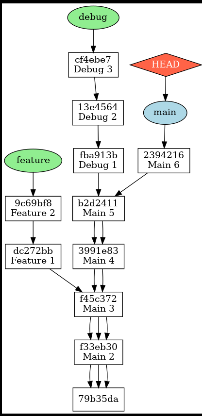

# LSVCS - Lightweight Version Control System

LSVCS (Lightweight Version Control System) is a Git-inspired version control system written entirely in Modern C++. It implements content-addressable storage using SHA-256 hashing and supports version tracking, branching, checkout, and repository visualization.

This project was built to understand the internal design of distributed version control systems by implementing their core concepts from scratch.

---

## Features

- Content-addressable object storage using SHA-256
- Blob objects for file storage
- Tree objects for directory hierarchy
- Commit objects with parent references
- Branch creation and switching
- Repository checkout (restore any previous commit)
- Commit history visualization using Graphviz
- Modular C++ project structure
- CMake build system

---

## Repository Structure

```
.
├── include/
│   ├── Blob.hpp
│   ├── Branch.hpp
│   ├── Checkout.hpp
│   ├── Commit.hpp
│   ├── Graphviz.hpp
│   ├── SHA256.hpp
│   ├── Staging.hpp
│   ├── Tree.hpp
│   └── Utils.hpp
│
├── src/
│   ├── Blob.cpp
│   ├── Branch.cpp
│   ├── Checkout.cpp
│   ├── Commit.cpp
│   ├── Graphviz.cpp
│   ├── SHA256.cpp
│   ├── Staging.cpp
│   ├── Tree.cpp
│   └── lsvcs.cpp
│
├── CMakeLists.txt
└── README.md
```

---

## Internal Repository Layout

LSVCS creates its own hidden repository structure:

```
.LSVCS/
├── blob/
├── tree/
├── commit/
├── branch/
├── HEAD
└── DOT.png
```

- **blob/** stores file contents.
- **tree/** stores directory hierarchy.
- **commit/** stores commit metadata.
- **branch/** stores branch pointers.
- **HEAD** points to the active branch.

Every object is identified by its SHA-256 hash.

---

## Commit Object

Each commit stores:

- Tree Hash
- Commit Hash
- Parent Commit Hash
- Commit Message

Example:

```
TREE HASH   : f0c65b626c1e80de9a1eee37501ea29e8d686bb42fb6eda5481e874629d9b8e1
HASH        : 2ec94ae3f19e99a967a6a8d5d59910b4410eefaf99739b4d3b38793ebed11904
PARENT HASH : 80d3f062e86263acf8daf57f7466d77330bf959302587f81ebadbe34eaf4686d
MESSAGE     : Branches in time-line
```

---

## Commit Graph

LSVCS can visualize repository history using Graphviz.

`assets/commit_graph.png`.

```text
README
└── assets
    └── commit_graph.png
```



```

---

## Build

Clone the repository

```bash
git clone https://github.com/Sushii-6745/LSVCS.git
cd LSVCS
```

Build using CMake

```bash
mkdir build
cd build
cmake ..
make
```

Run

```bash
./lsvcs
```

---

## Technologies Used

- C++17
- STL
- OpenSSL (SHA-256)
- CMake
- Graphviz

---

## Future Improvements

- Delta compression
- Merge support
- Commit log
- Diff engine
- Remote repository support
- Pack files
- Ignore rules (.lsvcsignore)

---

## Learning Outcomes

Through this project I explored:

- Content-addressable storage
- Hash-based object databases
- File system traversal
- Recursive tree construction
- Branch management
- Commit graph generation
- Build systems using CMake
- Modular C++ software design

---

## License

This project is licensed under the MIT License.
